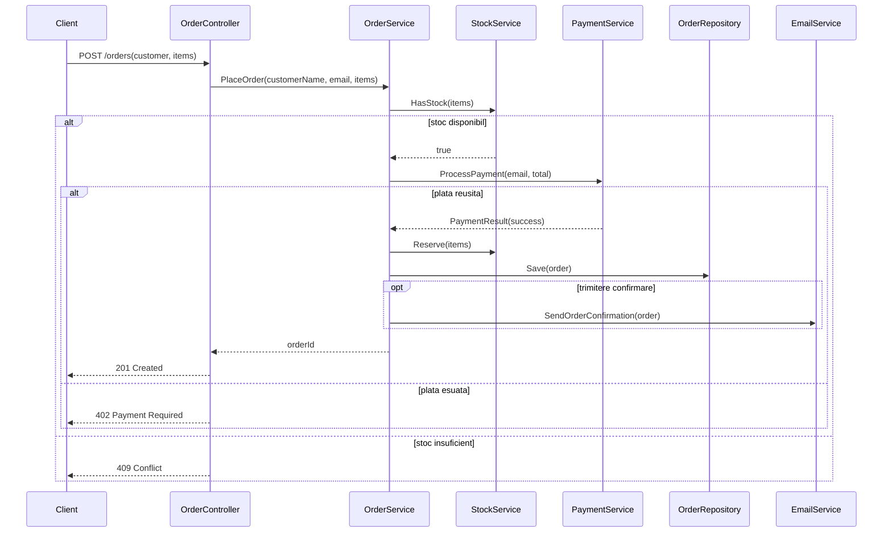
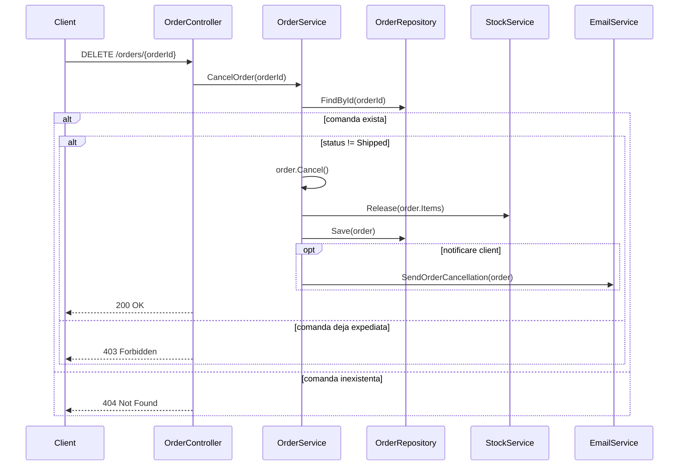

# Cerinta 3 — Diagrame de secventa (2 fluxuri)

## Enunt (din laborator)

| Flux | Descriere |
|------|-----------|
| **Flux 1** | Plasarea unei comenzi — de la HTTP la confirmare + email |
| **Flux 2** | Anularea unei comenzi — inclusiv cazul **anulare interzisa** (comanda expediată) |

Folositi blocuri **`alt`** (ramuri alternative) si **`opt`** (comportament optional).

Tool recomandat: **Mermaid** in fisiere `.md` (vizualizare pe GitHub / VS Code).

---

## Livrabil 3a — Flux 1: Plasare comanda

**Fisier:** [sequence-place-order.md](sequence-place-order.md)

Diagrama (preview):

---

## Livrabil 3b — Flux 2: Anulare comanda

**Fisier:** [sequence-cancel-order.md](sequence-cancel-order.md)

Diagrama (preview):

---

## Checklist

| Element | Flux 1 | Flux 2 |
|---------|--------|--------|
| Mesaje sincron | da | da |
| bloc `alt` | stoc / plata | exista comanda / Shipped |
| bloc `opt` | email confirmare | email anulare |
| Ramura esec | stoc, plata | 403, 404 |

