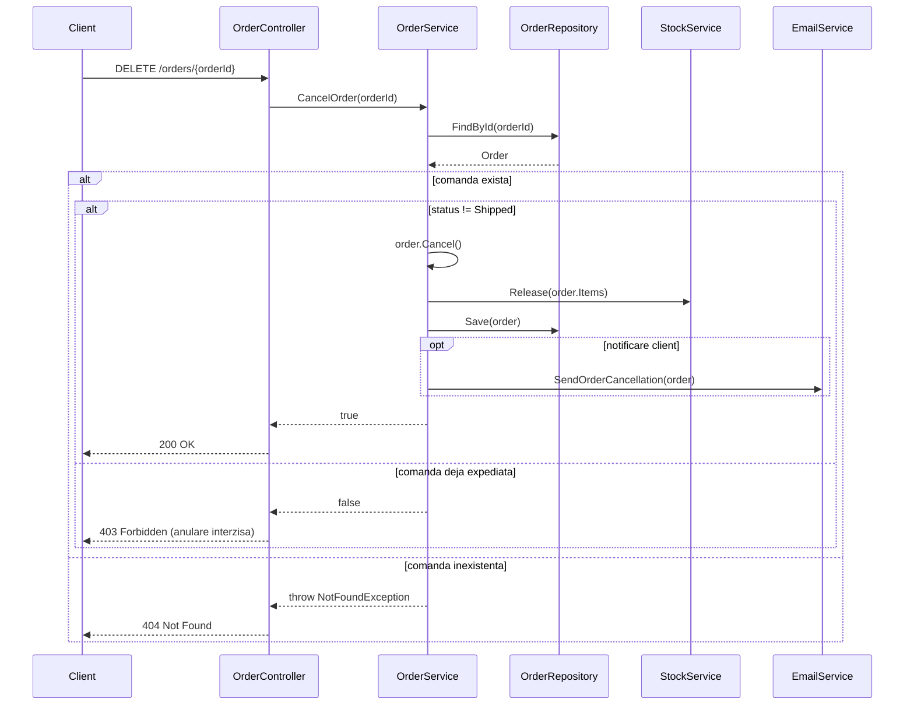

# Flux 2: Anularea unei comenzi

Diagrama de secventa pentru fluxul **Cancel Order**, inclusiv ramura in care anularea nu este permisa.

## Observatii

- Ramura `alt` pentru `Shipped` reflecta regula de business: comanda expediata nu se anuleaza.
- `Release` pe stoc restituie cantitatile rezervate la plasare.
- In varianta **Before**, `OrderManager.CancelOrder` combina validare, DB, stoc si email intr-o singura metoda.
