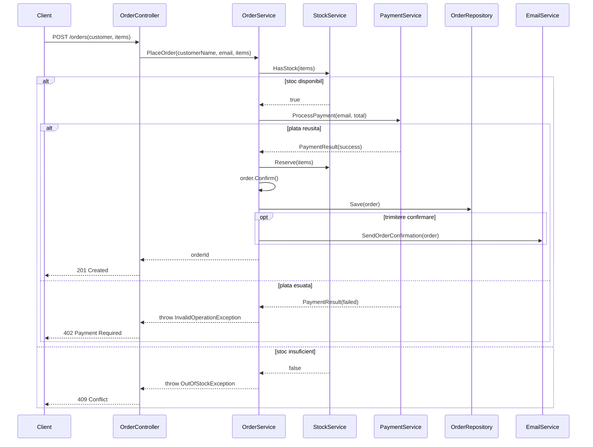

# Flux 1: Plasarea unei comenzi

Diagrama de secventa pentru fluxul **Place Order** (starea refactorizata — `OrderManagement.After`).

## Observatii

- Blocul `alt` separa ramura de succes de cea cu stoc insuficient.
- Blocul `opt` marcheaza emailul de confirmare ca pas optional (poate esua fara a anula comanda, in variante viitoare).
- In varianta **Before**, toate apelurile sunt inline in `OrderManager` (fara straturi separate).
