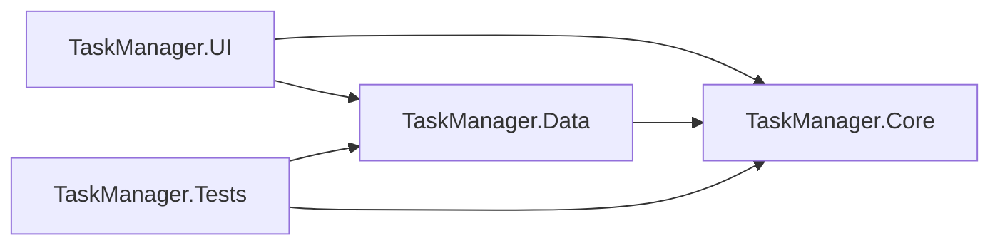

# Lab 4 — SOLID II (ISP + DIP)

Extindere **Laborator 3** (Task Manager): segregarea interfetelor si injectarea dependentelor cu container IoC.

Material curs: [curs4_solid2.html](../curs4_solid2.html) · baza Lab 3: [Lab3](../Lab3/)

## Structura

```
Lab4/
  TaskManager.sln
  src/
    TaskManager.Core/       interfete (Reader/Writer/Repository), servicii, modele
    TaskManager.Data/       SQLite + InMemory (depinde doar de Core)
    TaskManager.UI/         Composition Root, DI, consola
  tests/
    TaskManager.Tests/
```

## Dependente proiecte



```
  UI  ----->  Core  <-----  Data
              ^
              | (fara dependente externe in Core)
```

`TaskManager.Core` nu referentiaza `Data` si nu foloseste `Microsoft.Data.Sqlite`.

## Rulare

```bash
cd Lab4
dotnet restore TaskManager.sln
dotnet build TaskManager.sln
dotnet test TaskManager.sln
dotnet run --project src/TaskManager.UI
```

## Pachete NuGet noi (fata de Lab 3)

| Proiect | Pachet |
|---------|--------|
| TaskManager.UI | Microsoft.Extensions.DependencyInjection |

## Ce s-a schimbat fata de Lab 3

| Cerinta | Implementare |
|---------|----------------|
| ISP | `ITaskReader`, `ITaskWriter`, `ITaskRepository : ITaskReader, ITaskWriter` |
| ISP | `ReportService(ITaskReader)` — nu primeste `ITaskRepository` |
| DIP | Toate interfetele in Core; Data depinde de Core |
| DIP | `Program.cs` + `AddTaskManagerServices()` / `AddTaskManagerNotifiers()` |
| Teste | `ReportServiceTests`, `DipAndIspTests` (+ teste Lab 3) |

### De ce ReportService nu foloseste ITaskRepository

`ReportService` are nevoie doar de citire (`GetAll`). Daca ar primi `ITaskRepository`, ar depinde si de `Add`/`Update`/`Delete` — metode pe care nu le apeleaza niciodata (incalcare ISP). Cu `ITaskReader`, contractul reflecta exact rolul de raportare.

## Decizii de design SOLID

### S — Single Responsibility

| Componenta | Problema rezolvata |
|------------|-------------------|
| `TaskValidator` | Regulile de validare se schimba independent de persistare |
| `TaskService` | Orchestrare flux CRUD + finalizare |
| `ReportService` | Doar agregare statistici din citire |
| `ConsoleMenu` | Doar interactiune utilizator |

### O — Open/Closed

| Componenta | Problema rezolvata |
|------------|-------------------|
| `ITaskNotifier` + dictionar | Tip nou de notificare = clasa noua + inregistrare in DI, fara modificare `TaskService` |
| `SlackNotifier` | Demonstratie in UI, inregistrat in `AddTaskManagerNotifiers()` |

### L — Liskov Substitution

| Componenta | Problema rezolvata |
|------------|-------------------|
| `TaskItem` / `RecurringTask` / `DeadlineTask` | `Complete()` cu acelasi contract pentru toate subtipurile |
| `InMemoryTaskRepository` / `SqliteTaskRepository` | Interschimbabile unde e nevoie de `ITaskRepository` sau `ITaskReader` |

### I — Interface Segregation

| Componenta | Problema rezolvata |
|------------|-------------------|
| `ITaskReader` / `ITaskWriter` | Clientii citesc sau scriu doar ce folosesc |
| `ReportService` | Depinde de `ITaskReader`, nu de operatii de scriere |

### D — Dependency Inversion

| Componenta | Problema rezolvata |
|------------|-------------------|
| Interfete in Core | Logica de business nu depinde de SQLite |
| `SqliteTaskRepository` in Data | Detaliu infrastructura inlocuibil |
| `ServiceCollection` in UI | Composition Root unic; fara `new` in meniu pentru servicii |

## Teste

- Teste Lab 3: ierarhie sarcini, validator, serviciu CRUD
- Teste Lab 4: raport cu `ITaskReader`, `TaskService` fara repository null, notificatori parametrizati

## Legatura cursuri

| Lab | Curs | Continut |
|-----|------|----------|
| Lab1-2 | 2 UML | Order Management + diagrame |
| Lab3 | 3 SOLID I | Task Manager: SRP, OCP, LSP |
| Lab4 | 4 SOLID II | Acelasi domeniu: ISP, DIP, IoC |
