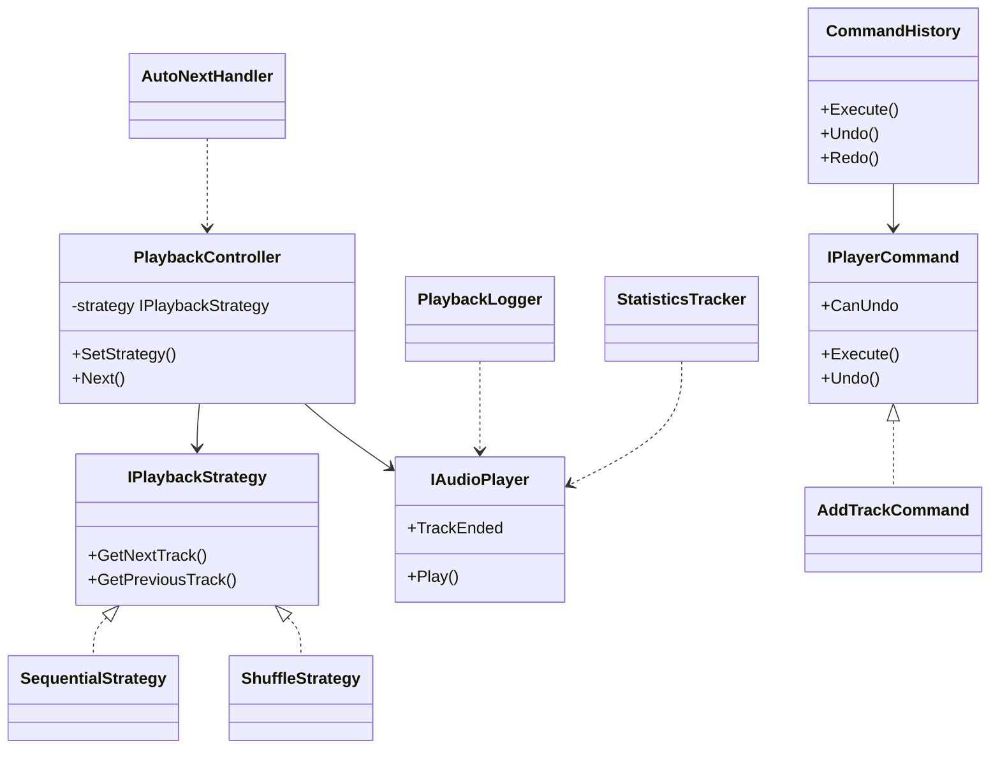
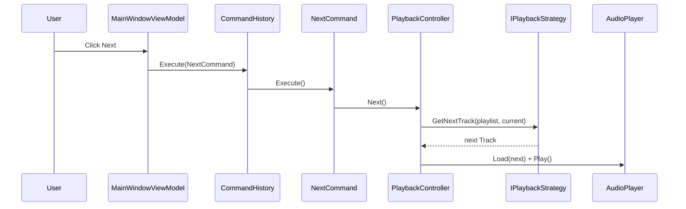

# Lab 8 — Pattern-uri comportamentale I (Observer, Strategy, Command)

Laborator **Curs 8** MAP: **MusicPlayer** — player audio desktop WPF cu NAudio.

Material curs: [curs8_patterns_behavioral1.html](../curs8_patterns_behavioral1.html)

## Structura

```
Lab8/
  MusicPlayer.sln
  src/
    MusicPlayer.Core/     # domeniu, strategii, comenzi, observatori
    MusicPlayer.App/      # WPF + NAudio + MVVM
  tests/
    MusicPlayer.Tests/
```

## Rulare

```bash
cd Lab8
dotnet restore MusicPlayer.sln
dotnet build MusicPlayer.sln
dotnet test MusicPlayer.sln
dotnet run --project src/MusicPlayer.App
```

Adaugati fisiere `.mp3` / `.wav` in `src/MusicPlayer.App/samples/` sau folositi **Add Files** din aplicatie.
Log-ul de redare se scrie in `playback_log.txt`.

## Pattern-uri

### Observer

**Problema:** schimbarile de stare (track, pozitie, playlist) trebuie propagate catre UI, log si statistici fara cuplare stransa.

**Unde:**
- `AudioPlayer` — `INotifyPropertyChanged` + `TrackEnded`
- `Playlist` — `ObservableCollection` / `CollectionChanged`
- `MainWindowViewModel` — actualizeaza UI
- `PlaybackLogger` — scrie evenimente in fisier
- `StatisticsTracker` — minute/artist, top piese, skip-uri
- `AutoNextHandler` — next automat la sfarsitul track-ului

### Strategy

**Problema:** modul de alegere a track-ului urmator variaza (sequential, shuffle, smart, repeat).

**Unde:** `IPlaybackStrategy`, `SequentialStrategy`, `ShuffleStrategy`, `SmartShuffleStrategy`, `RepeatOneStrategy` in `Strategies/`. Injectate in `PlaybackController.SetStrategy()`.

### Command

**Problema:** actiunile utilizatorului (play, add, remove, change strategy) sunt obiecte cu undo/redo.

**Unde:** `IPlayerCommand`, comenzi in `Commands/`, `CommandHistory` cu stive undo/redo (max 50).

## Cerinte laborator

| Cerinta | Implementare |
|---------|----------------|
| Model domeniu (Track, Playlist, PlayerState) | da |
| AudioPlayer NAudio | da |
| 4 strategii playback | da |
| Comenzi + undo/redo | da |
| Observatori (UI, log, statistici, auto-next) | da |
| Interfata WPF MVVM | da |
| Teste unitare strategii/comenzi | da (9 teste) |

## Diagrame (Mermaid)

### Clase — cele 3 pattern-uri



### Secventa — User apasa Skip



## Teste

- `StrategyTests` — sequential, repeat all, shuffle, repeat one
- `CommandHistoryTests` — undo, redo invalidat
- `PlaylistCommandTests` — remove undo la index original, clear undo
