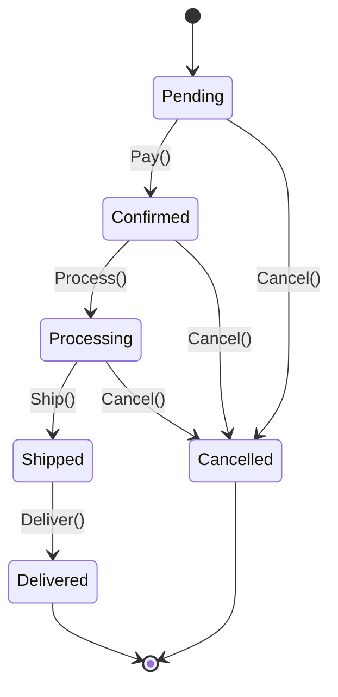
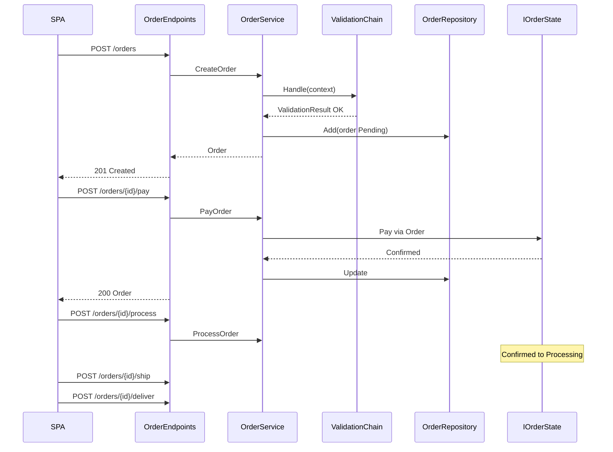
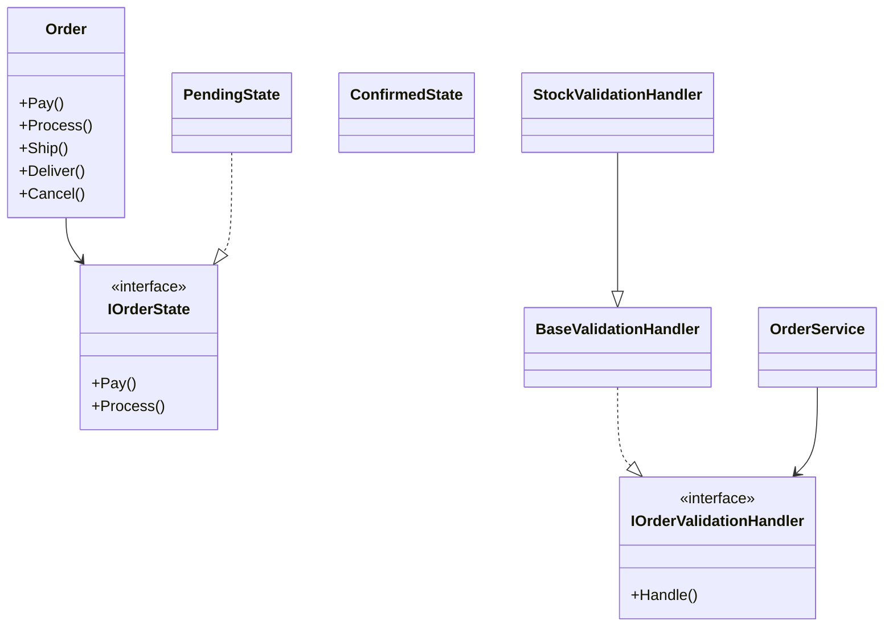

# Lab 9 — Pattern-uri comportamentale II (Chain of Responsibility + State)

Laborator **Curs 9** MAP: **OrderProcessing** — Web API .NET 8 + SPA vanilla (HTML/CSS/JS).

Material curs: [curs9_patterns_behavioral2.html](../curs9_patterns_behavioral2.html)

## Structura

```
Lab9/
  OrderProcessing.sln
  src/OrderProcessing.Api/
    Domain/          Order, Customer, Money, Address, OrderId
    States/          IOrderState + 6 stari
    Validation/      Chain of Responsibility (4 handler-i)
    Services/        OrderService, InMemoryOrderRepository
    Endpoints/       Minimal API
    wwwroot/         SPA (index.html, styles.css, app.js)
  docs/
    requests.http
    screenshots/     (adauga PNG-uri din UI)
```

## Rulare

```bash
cd Lab9
dotnet restore OrderProcessing.sln
dotnet run --project src/OrderProcessing.Api
```

| URL | Rol |
|-----|-----|
| http://localhost:5000 | SPA |
| http://localhost:5000/swagger | Swagger UI |

## Pattern-uri

### Chain of Responsibility

**Problema:** validarea la creare comanda are pasi independenti; primul esec opreste pipeline-ul.

**Unde:** `Validation/` — ordine: Stock → Price → Fraud → Age (`ValidationChainFactory`).

### State

**Problema:** tranzitiile comenzii depind de starea curenta; regulile nu trebuie intr-un switch monolit pe `Order`.

**Unde:** `States/` — `Order` delegheaza `Pay`, `Process`, `Ship`, `Deliver`, `Cancel` catre `IOrderState`.

### Facade (orchestrare API)

**Problema:** clientul (SPA) apeleaza o singura operatie; complexitatea ramane in backend.

**Unde:** `OrderEndpoints` + `OrderService` — un singur punct de acces pentru SPA.

## Order Lifecycle



`Cancel()` nu este permis din `Shipped` sau `Delivered`.

## Diagrama de secventa (flux complet)



## Diagrama de clase (simplificata)



## API

| Metoda | Cale | Raspuns |
|--------|------|---------|
| POST | /orders | 201 / 400 |
| GET | /orders | 200 |
| GET | /orders/{id} | 200 / 404 |
| POST | /orders/{id}/pay | 200 / 409 |
| POST | /orders/{id}/process | 200 / 409 |
| POST | /orders/{id}/ship | 200 / 409 |
| POST | /orders/{id}/deliver | 200 / 409 |
| POST | /orders/{id}/cancel | 200 / 409 |
| GET | /api/products | catalog produse |

## Testare manuala

Fisier: [docs/requests.http](docs/requests.http)

Scenarii:
- creare valida
- stoc insuficient (produs Vin rosu, stoc 0)
- varsta sub 18 cu produs restrictionat
- tranzitii Pay → Process → Ship → Deliver
- Cancel pe Shipped sau Delivered → 409

## Screenshot-uri SPA

Folder [docs/screenshots/](docs/screenshots/) — captureaza UI-ul in rulare pentru:
1. Comanda noua / Pending cu Pay + Cancel active
2. Shipped — doar Deliver enabled
3. Toast eroare tranzitie invalida
4. Toast validare stoc esuata

## Cerinte laborator

| Cerinta | Status |
|---------|--------|
| Domain (Order, VO, History) | da |
| Chain validare short-circuit | da |
| State 6 stari + exceptie | da |
| OrderService | da |
| Minimal API + coduri HTTP | da |
| SPA 2 coloane + modal + toast | da |
| README Mermaid | da |
| requests.http | da |
